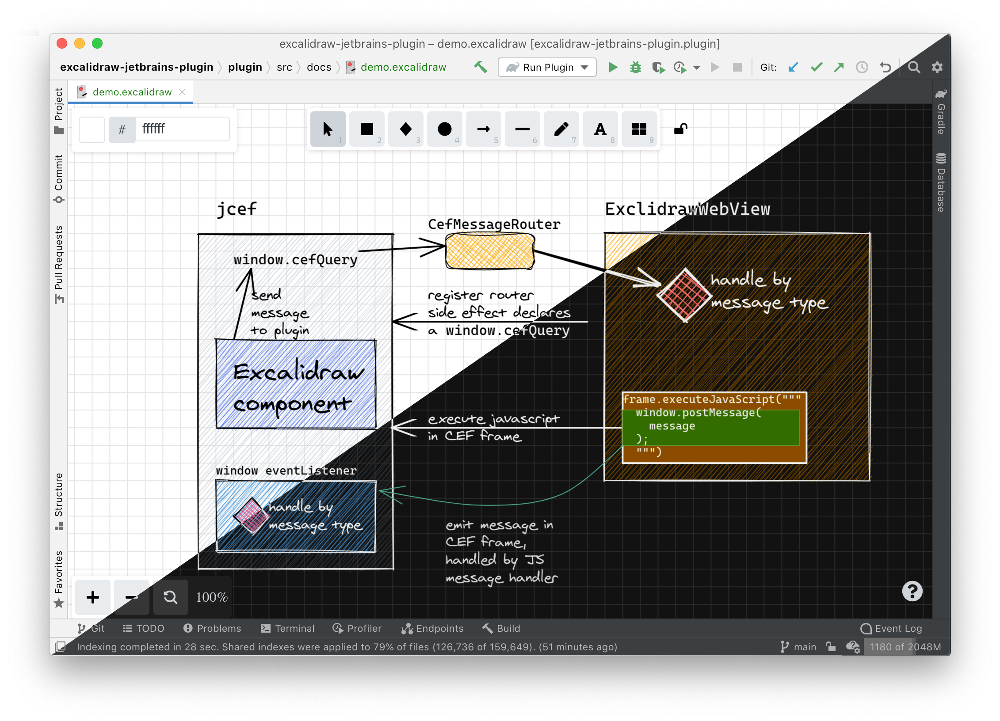

# Excalidraw Jetbrains plugin


[](https://plugins.jetbrains.com/plugin/17096)
[](https://plugins.jetbrains.com/plugin/17096)
[](https://conventionalcommits.org)




<!-- Plugin description -->
This plugin allows creating or editing [Excalidraw](https://excalidraw.com/)
virtual whiteboard within the IDE.
<!-- Plugin description end -->

## Installation

- Using IDE built-in plugin system:
  
  <kbd>Settings/Preferences</kbd> > <kbd>Plugins</kbd> > <kbd>Marketplace</kbd> > <kbd>Search for "excalidraw-jetbrains-plugin"</kbd> >
  <kbd>Install Plugin</kbd>
  
- Manually:

  Download the [latest release](https://github.com/bric3/excalidraw-jetbrains-plugin/releases/latest) and install it manually using
  <kbd>Settings/Preferences</kbd> > <kbd>Plugins</kbd> > <kbd>⚙️</kbd> > <kbd>Install plugin from disk...</kbd>


## How do I build and run this project?

For development purpose, clone the project locally and start it with 
the command:

```
./gradlew runIde
```

This will build the plugin and start a sandboxed instance of IntelliJ with 
the plugin already installed. You can even start this in debug mode.


----
The Logo is inspired from the actual [Excalidraw logo](https://github.com/excalidraw/excalidraw-logo/blob/afabcf3f9f5e12d6b1574bc7abd5d63466744155/logo256.svg) (MIT licensed).